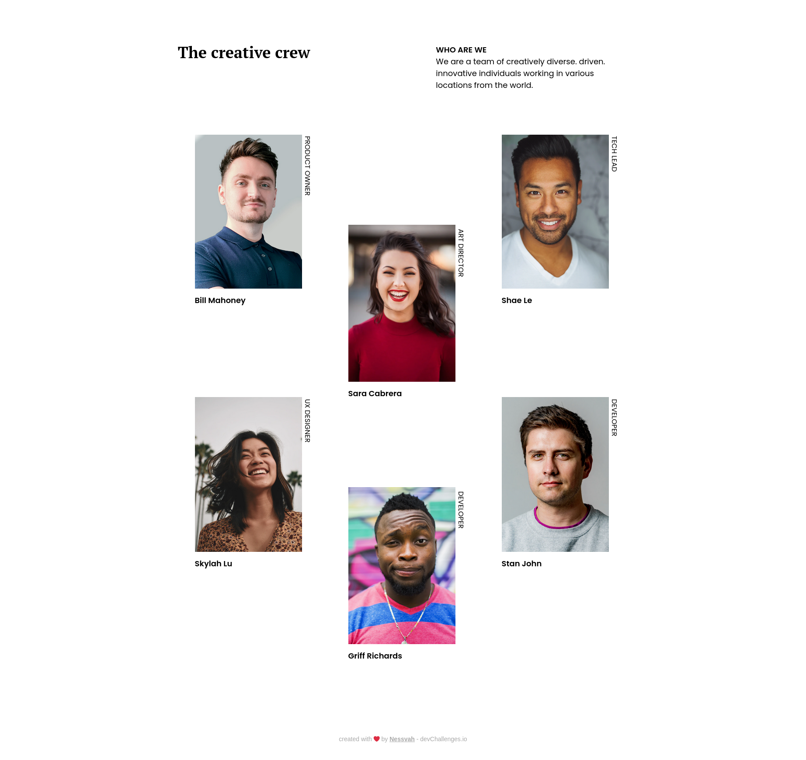
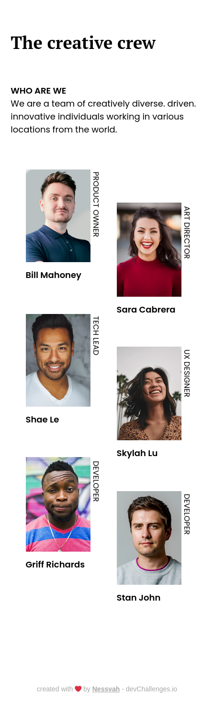

# My team page

My solution for a challenge from [Devchallenges.io](http://devchallenges.io)

### Demo

[Click Here](https://nessvahteampagemaster.netlify.app)

### Solution

[Click Here](https://github.com/Nessvah/My-team-page-master)

### Challenge

[Click Here](https://devchallenges.io/challenges/hhmesazsqgKXrTkYkt0U)

<!-- TABLE OF CONTENTS -->

## Table of Contents

- [My team page](#my-team-page)
    - [Demo](#demo)
    - [Solution](#solution)
    - [Challenge](#challenge)
  - [Table of Contents](#table-of-contents)
  - [Overview](#overview)
    - [Built With](#built-with)
    - [Deployed With](#deployed-with)
  - [Features](#features)
  - [Contact](#contact)

<!-- OVERVIEW -->

## Overview

- In this project, I tried to do the desktop version first and go smaller. I think it was harder adjusting the code already in place to work on smaller sizes I even needed to add the tablet version on this project because it wasn't working correctly. I think that if I started mobile-first, it would have been easier from the beginning and maybe with less code.
- In this project, I used grid to lay out the main content. It was very hard, especially because I was trying to make it responsive without using media queries and I wasn't successful.

### Built With

<!-- This section should list any major frameworks that you built your project using. Here are a few examples.-->

- HTML
- CSS
  - FLEXBOX/GRID
- FIGMA

### Deployed With

- [Netlify](https://www.netlify.com/)

## Features

<!-- List the features of your application or follow the template. Don't share the figma file here :) -->

This application/site was created as a submission to a [DevChallenges](https://devchallenges.io/challenges) challenge. The [challenge](https://devchallenges.io/challenges/hhmesazsqgKXrTkYkt0U) was to build a webpage to complete the given user stories.

## Contact

- GitHub [@nessvah](https://github.com/Nessvah)
- Twitter [@nessvah\_](https://twitter.com/Nessvah_)
